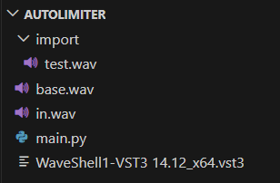
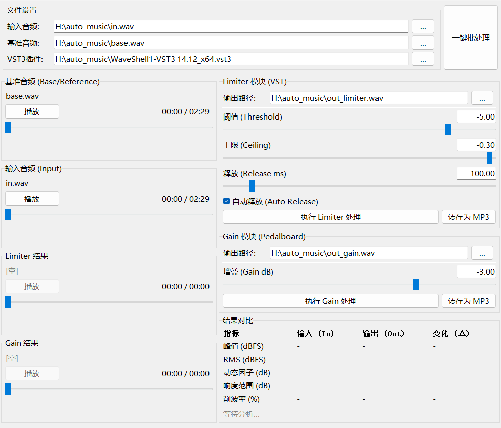

# 简易 L1 Limiter（自用）

无需打开 DAW，直接调用 **Waves L1** 处理音频，并提供 Peak/RMS/响度等数据的前后对比分析（就只是把 DAW 的 Limiter 插件拿到外头用而已）。
（本机 Win11 系统，自用，不对 bug 及其它问题负责）

## 1. 插件要求
本项目**不包含** Waves 插件本身，请确保本机拥有正版授权并已安装 **Waves L1 (V14)** 。
程序需要调用 **VST3 Shell**，插件安装后相应文件的常见路径参考如下：
> Shell文件：`C:\Program Files\Common Files\VST3\WaveShell1-VST3 14.12_x64.vst3`
> L1 插件：`C:\Program Files (x86)\Waves\Plug-Ins V14\L1.bundle`

## 2. 环境准备与运行

需要 Python 3.8 或更高版本，并运行以下命令安装依赖：
```bash
pip install numpy soundfile sounddevice pedalboard pydub
```
启动程序：
```
python main.py
```

## 3. 其它说明
必备文件参考，`import`中放一个wav文件，名称任意：



运行后将在图形界面中操作：



界面加载后，可自行对 **基准音频**（仅用于实时播放方便音量大小比对）、**输入音频**（将被Limiter处理） 和 **输出路径** 进行选择，默认使用项目文件夹中的 **VST3** Shell 文件，可自行选择本机的文件（通常位于 C:\Program Files\Common Files\VST3）或复制过来。

设置参数后点击“执行 Limiter 处理”或“执行 Gain 处理”，二者互斥，处理完成后可直接试听并查看各项响度指标变化，结果对比展示的是输入音频与最近一次处理结果的对比。

“一键批处理”将读取`import`文件夹中的wav文件，生成以下文件至`export` 文件夹：
    **音量大**: L1 Limiter: Threshold=-4, Ceiling=-0.3, Release=100, Auto Release=On
    **音量中**: 原始音频复制
    **音量小**: Gain=-3
    (并且均会自动生成对应的 MP3 版本)


代码编写过程中使用了 Google Gemini 进行辅助。

